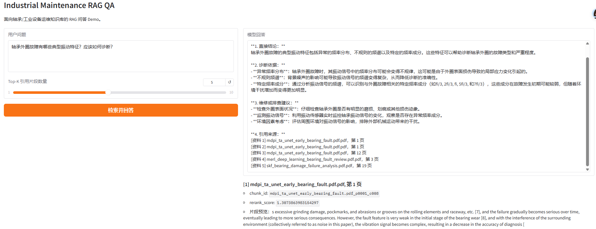

# Industrial Maintenance RAG QA

A retrieval-augmented generation system for industrial equipment maintenance and bearing fault diagnosis.

This project builds a local RAG pipeline for industrial maintenance documents, including PDF parsing, text chunking, dense retrieval, BM25 sparse retrieval, hybrid fusion, reranking, evidence-grounded answer generation, FastAPI service, Gradio demo, and evaluation.

## 1. Project Features

- PDF document parsing with page-level metadata
- Sliding-window text chunking
- BAAI/bge-m3 dense embedding
- Milvus vector database
- BM25 sparse retrieval
- Dense + BM25 hybrid retrieval
- RRF result fusion
- BAAI/bge-reranker-v2-m3 reranking
- Local Qwen2.5-Instruct generation
- Evidence-grounded prompt design
- Source citation with file name, page number, and chunk ID
- FastAPI backend
- Gradio web demo
- Retrieval and answer generation evaluation
- Unit tests for parser, chunker, and retriever

## 2. System Architecture

~~~text
PDF Documents
    |
    v
PDF Parser
    |
    v
Page-level Documents JSONL
    |
    v
Sliding-window Chunker
    |
    v
Chunks JSONL
    |
    +-------------------------+
    |                         |
    v                         v
BGE-M3 Dense Embedding     BM25 Sparse Retrieval
    |                         |
    v                         v
Milvus Vector Search       Keyword Search
    |                         |
    +-----------+-------------+
                |
                v
        RRF Hybrid Fusion
                |
                v
        BGE Reranker
                |
                v
        Top Evidence Chunks
                |
                v
        Local Qwen Generation
                |
                v
Answer + Sources + Page + Chunk ID
~~~

## 3. Environment

Recommended environment:

- Windows + WSL2 Ubuntu
- Miniconda
- Python 3.10
- Docker Desktop
- Milvus Standalone
- Local Qwen model

Create environment:

~~~bash
conda create -n industrial-rag python=3.10 -y
conda activate industrial-rag
pip install -r requirements.txt
~~~

## 4. Start Milvus

~~~bash
docker compose up -d
docker ps
~~~

Milvus default ports:

~~~text
gRPC: 19530
HTTP/metrics: 9091
~~~

## 5. Prepare Documents

Put PDF files into:

~~~text
data/raw_docs/
~~~

The repository does not include large PDF files. Users should prepare their own industrial maintenance manuals, bearing failure analysis documents, or related papers.

## 6. Build Knowledge Base

Parse PDF documents:

~~~bash
python scripts/01_parse_docs.py
~~~

Build text chunks:

~~~bash
python scripts/02_build_chunks.py
~~~

Build Milvus vector index:

~~~bash
python scripts/03_build_milvus_index.py
~~~

## 7. Test Retrieval

Dense retrieval:

~~~bash
python scripts/04_query_rag.py \
  --question "What are the typical vibration characteristics of bearing outer race faults?" \
  --top_k 5
~~~

BM25 retrieval:

~~~bash
python scripts/04_query_bm25.py \
  --question "bearing outer race fault BPFO spectrum" \
  --top_k 5
~~~

Hybrid retrieval with reranker:

~~~bash
python scripts/04_query_hybrid_rerank.py \
  --question "bearing outer race fault BPFO spectrum" \
  --top_k 5
~~~

## 8. Test Full RAG QA

~~~bash
python scripts/05_query_rag_with_llm.py \
  --question "What are the typical vibration characteristics of bearing outer race faults and how should they be diagnosed?" \
  --top_k 5
~~~

## 9. Start FastAPI

~~~bash
uvicorn app.api:app --host 0.0.0.0 --port 8000
~~~

Open API documentation:

~~~text
http://localhost:8000/docs
~~~

Example query:

~~~bash
curl -X POST http://127.0.0.1:8000/query \
  -H "Content-Type: application/json" \
  -d '{"question":"What are the typical vibration characteristics of bearing outer race faults?","top_k":5}'
~~~

## 10. Start Gradio Demo

Open another terminal:

~~~bash
conda activate industrial-rag
python app/gradio_app.py
~~~

Open:

~~~text
http://localhost:7860
~~~

## 11. Demo Screenshot

The Gradio interface supports industrial maintenance question answering with retrieved evidence, source file names, page numbers, chunk IDs, and reranker scores.

## 12. Retrieval Evaluation

| Metric | Score |
|---|---:|
| Recall@5 | 1.0000 |
| Recall@10 | 1.0000 |
| MRR | 0.9250 |
| nDCG@5 | 0.8728 |

The retrieval pipeline uses BGE-M3 dense retrieval, BM25 sparse retrieval, RRF fusion, and BGE reranker. The evaluation set contains manually annotated bearing maintenance QA samples.

## 13. Answer Generation Evaluation

| Metric | Score |
|---|---:|
| Answer Coverage | 0.9333 |
| Citation Presence Rate | 1.0000 |
| Hallucination Flag Rate | 0.0000 |

The answer generation module uses retrieved and reranked evidence chunks as context. The prompt constrains the local Qwen model to cite only provided source files, page numbers, and chunk IDs.

## 14. Makefile Commands

Common project commands are wrapped in `Makefile` for easier reproduction.

~~~bash
make docker-up        # Start Milvus standalone
make parse            # Parse PDF documents
make chunk            # Build text chunks
make index            # Build Milvus vector index
make retrieve         # Test hybrid retrieval + reranker
make rag              # Test full RAG QA
make api              # Start FastAPI service
make gradio           # Start Gradio demo
make eval-retrieval   # Run retrieval evaluation
make eval-answer      # Run answer generation evaluation
make test             # Run unit tests
~~~

## 15. Project Structure

~~~text
industrial-maintenance-rag-qa/
├── app/
│   ├── api.py
│   └── gradio_app.py
├── configs/
│   ├── rag_config.yaml
│   ├── milvus_config.yaml
│   └── model_config.yaml
├── data/
│   ├── raw_docs/
│   ├── parsed/
│   ├── chunks/
│   └── eval/
├── docs/
│   ├── project_design.md
│   ├── experiment_report.md
│   ├── retrieval_eval_report.md
│   └── answer_eval_report.md
├── scripts/
├── src/
├── tests/
├── docker-compose.yml
├── Makefile
├── requirements.txt
└── README.md
~~~

## 16. Notes

Large files such as PDF documents, Milvus runtime data, model files, and checkpoints are not included in the repository.

Ignored paths include:

~~~text
data/raw_docs/*
data/parsed/*
data/chunks/*
volumes/
models/
checkpoints/
~~~

